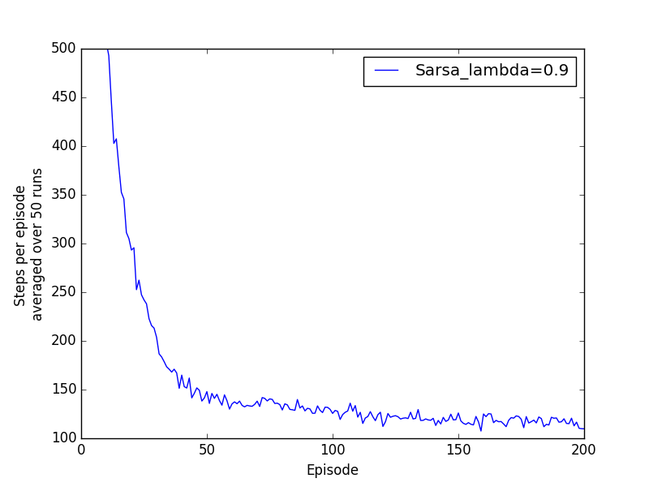
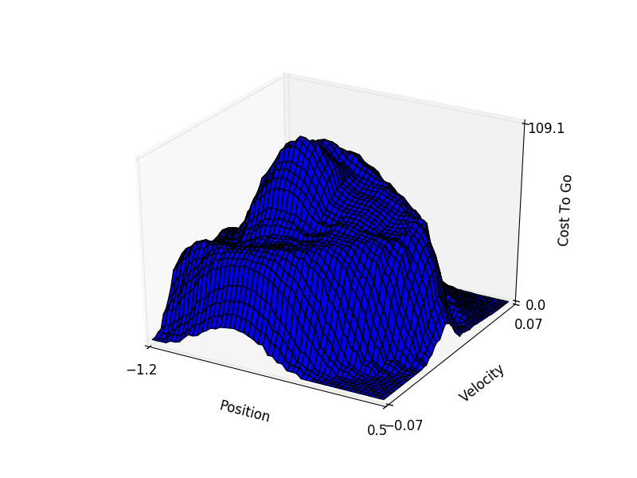

# Assignment 7
## Part 1
### How to Run Code
``` python
python mountaincar_exp.py # 50 runs
```
## Part 2
### How to Run Code
```python
python plot.py # Plot learning curve to part2.png
```

## Part 3
### How to Run Code
```python
python mountaincar_exp.py # Do 1 run of 1000 episodes
python plot2.py # Create and save 3D plot to part3.png
```



### Notes
Please note there are two plot types available, with the default being a surface. To alternate, in `plot2.py` uncomment one of the following lines:
```python
ax.plot_wireframe(x1, y1, data)
ax.plot_surface(x1,y1,data, cstride=1, rstride=1)
```
A few extra photos are included as `part3-#.png`
## Bonus