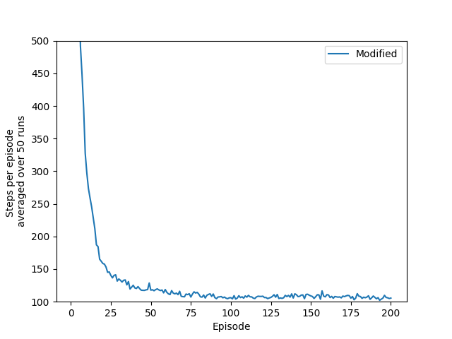

# Assignment 7
## Part 1
### How to Run Code
``` python
python mountaincar_exp.py # 50 runs
```
## Part 2
### How to Run Code
```python
python plot.py # Plot learning curve to part2.png
```

## Part 3
### How to Run Code
```python
python mountaincar_exp.py # Do 1 run of 1000 episodes
python plot2.py # Create and save 3D plot to part3.png
```


### Notes
Please note there are two plot types available, with the default being a surface. To alternate, in `plot2.py` uncomment one of the following lines:
```python
ax.plot_wireframe(x1, y1, data)
ax.plot_surface(x1,y1,data, cstride=1, rstride=1)
```
A few extra photos are included as `part3-#.png`
## Bonus
### How to Run Code
```python 
python mountaincar_exp.py
python plot.py # Write learning curve to bonus.png
```


Optionally, if Part 1 has been calculated as above, you can see the Modified vs Unmodified learning graphs simultaneously with the following:
```python
python plot2.py
```


### Results
```
Unmodified
Mean: -39984.14
Std: 711.509775337
Error: 100.622677404
...
Modified
Mean: -30511.1
Std: 1288.71249315
Error: 182.251468581
...
Did it Change?
Improvement: 51.9778527644
```

### Modifications

The only modifications are that I implemented Accumulating Traces in the modified agent. Modified and Unmodified used 50 runs. Not only do we see faster learning off the start, Accumulating Traces generally takes fewer steps to get to the goal all the way up to 200 episodes.